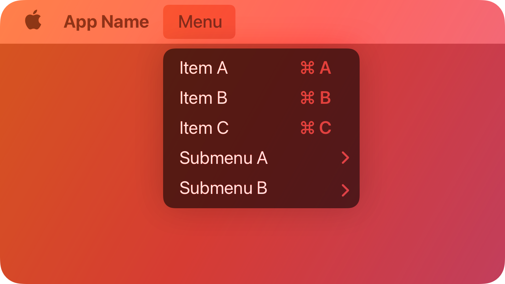

# 🎉 macOS Menu Bar App Starter Kit

  

Welcome to the **macOS Menu Bar App Starter Kit**! 🎉 This is your go-to resource for building lightweight and functional macOS menu bar apps. Whether you’re new to macOS development or want a head start, these templates will help you skip the headaches and get straight to building.  

---

## Why Menu Bar Apps? 🤔  

Menu bar apps are the secret weapon of macOS. They’re lightweight, always accessible, and great for solving quick, everyday problems. Whether it’s checking the weather, renaming files, or monitoring your Wi-Fi, menu bar apps keep things simple and useful.  

But let’s be honest: getting started isn’t simple.  

---

## What’s Inside 🛠️  

This repo has two templates and a collection of examples to inspire you:  

### Templates (📂 [Templates](./Templates))  

| Template           | Description                                           |
|--------------------|-------------------------------------------------------|
| **Classic Style**  | A dropdown menu bar app. Lightweight and simple.      |
| **Window Style**   | A menu bar app with a detachable window for more features. |  

### Examples (📂 [Examples](./Examples))  

These are fully built apps to show off what’s possible with menu bar apps. Check them out for inspiration!  

---

## Features ✨  

Both templates are built to be beginner-friendly and include:  

- 🗂️ **Pre-Tweaked Info.plist**: Removes unnecessary dock icons and windows, so your app works like a real menu bar app.  
- 💬 **Beginner-Friendly Comments**: Each part of the code is well-documented to help you understand and customize it.  
- ⚡ **Ready-to-Go Functionality**: No setup required—just download, run, and start building.  
- 🖥️ **SwiftUI-Powered**: Built using Apple’s modern framework, making the code clean and future-proof.  
- 🎨 **Customizable Menu Bar Label**: Use text, emojis, or icons to match your app’s personality.  
- 🧩 **Core Features Prebuilt**: Includes examples of menu items, submenus, and Quit buttons to get you started.  

---

## How to Use 🖱️  

1. **Clone this repo:**  

   ```bash  
   git clone https://github.com/hellodx-co/macos-menu-bar-starter-kit.git  
   cd macos-menu-bar-starter-kit  
   ```  

2. **Pick your starting point:**  
   - Go to `Templates` for starter projects.  
   - Go to `Examples` for fully built apps.  

3. **Open in Xcode:**  
   Open the `.xcodeproj` file for your template or example.  

4. **Run and customize:**  
   Build your app and start making it yours.  

---

## Template Highlights 🚀  

### Classic Template  
- A dropdown menu app using SwiftUI’s `MenuBarExtra`.  
- Preloaded with basic menu items, submenus, and a Quit button.  

### Window Template  
- A menu bar app with a detachable window (powered by `.menuBarExtraStyle(.window)`).  
- Perfect for settings, forms, or more detailed layouts.  

---

## Want to Contribute? 🤝  

We’d love to see your menu bar creations! Here’s how:  
1. 🍴 Fork this repo.  
2. 🛠️ Add your template or example app.  
3. 📝 Update the README with your addition.  
4. 📤 Submit a pull request.  

---

## Build Something Awesome 🏗️  

We built this starter kit because building menu bar apps doesn’t have to be hard. Now it’s your turn! ⭐ Star the repo, share it, and let us know what you make.  

Menu bar apps are awesome—and building them can be, too. 🎉  
